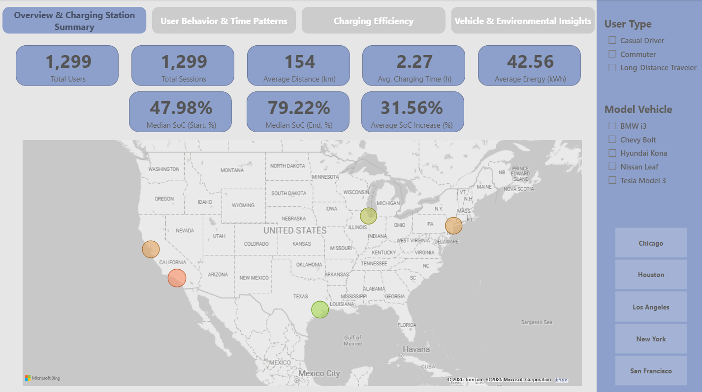
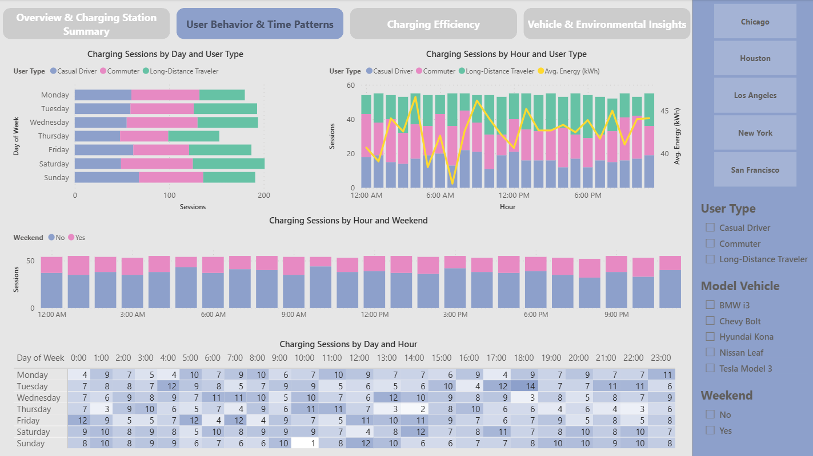
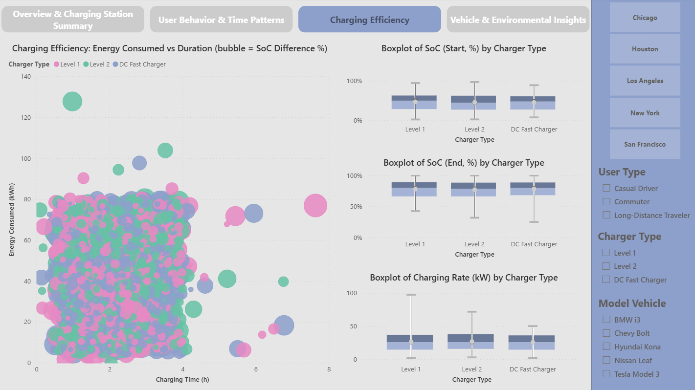
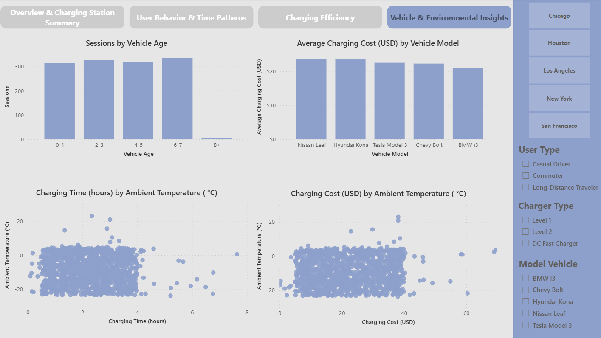
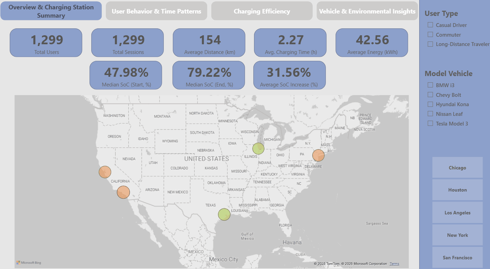

# Analyse des données de recharge des véhicules électriques (EV Charging Patterns)

## Objectif du projet
Ce projet présente la préparation des données et l'analyse exploratoire (EDA) d’un jeu de données sur les sessions de recharge de véhicules électriques.  
L’objectif est d’identifier les comportements des utilisateurs et les tendances de recharge avant la création d’un rapport interactif sous Power BI.

## Description du dataset
Le dataset provient de Kaggle : [Electric Vehicle Charging Patterns](https://www.kaggle.com/datasets/valakhorasani/electric-vehicle-charging-patterns?resource=download)
Auteur : Vala Khorasani
Licence : Apache 2.0 Licence

## Technologies utilisées
- Python 3.13.5
- Pandas
- NumPy
- Seaborn / Matplotlib / Plotly
- Jupyter Notebook
- Power BI Desktop

## Étapes réalisées
- Nettoyage et validation des données
- Analyse statistique et création de nouvelles variables (feature engineering)
- Visualisation interactive
- Interprétation métier dans le contexte de l’électromobilité

## Instructions pour exécuter le notebook
1. Cloner le repo :
```bash
git clone https://github.com/anbialek/ElectricVehicleChargingDataAnalysis.git
```
2. Installer les dépendances :
```bash
pip install -r requirements.txt
```
3. Ouvrir le notebook :
```bash
jupyter notebook 01_data_cleaning_eda.ipynb
```
---

### 🇬🇧 Summary (for non-French readers)

Data cleaning and exploratory analysis of electric vehicle charging sessions.  
Focus on user behavior patterns, charging efficiency, and data validation before Power BI reporting.

---

##  Rapport Power BI — EV Charging Insights
Le rapport interactif Power BI permet d’explorer les comportements de recharge, l’efficacité énergétique et les facteurs environnementaux.
Il se compose de 4 pages :
- Overview – KPIs principaux et carte des stations de recharge
- User Behavior & Time Patterns – habitudes des conducteurs selon le type d’utilisateur
- Charging Efficiency – efficacité de recharge et analyse de la durée
- Vehicle & Environmental Insights – impact du modèle du véhicule et de la température

## Instructions pour ouvrir le rapport
1. Télécharger **Power BI Desktop** : [https://powerbi.microsoft.com/desktop/](https://powerbi.microsoft.com/desktop/)
2. Ouvrir le fichier `ElectricVehicleCharging.pbix`
3. Les visuels sont entièrement interactifs

## Présentation du projet
|  |  |
|:--------------------------------------------------------------:|:--------------------------------------------------------------:|
|  |  |

Une courte démonstration du rapport a été enregistrée à l’aide de **ScreenToGif** afin d’illustrer les interactions dans Power BI.



---

### 🇬🇧 Summary (for non-French readers)

This Power BI dashboard provides an interactive exploration of electric vehicle charging data.
It highlights user behavior trends, charging efficiency metrics, and environmental patterns to support data-driven insights in e-mobility.
  
